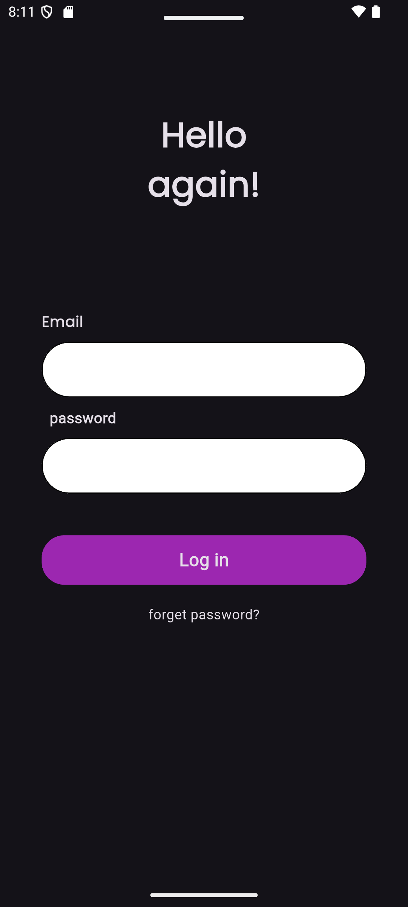
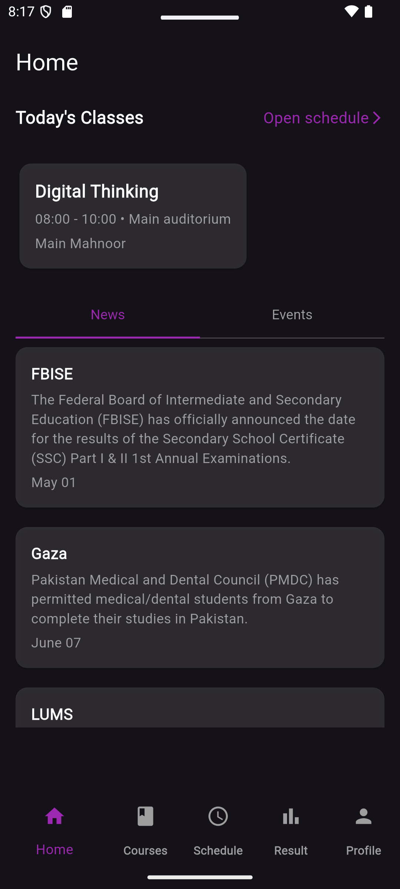
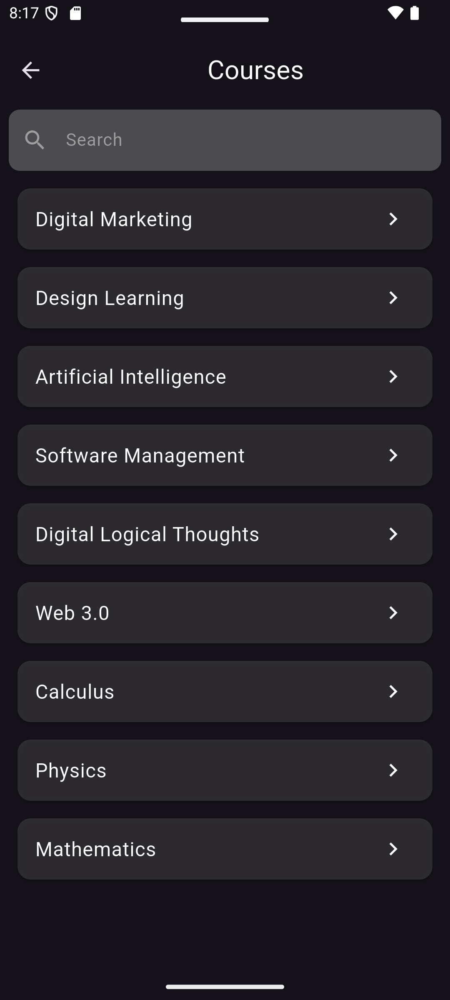
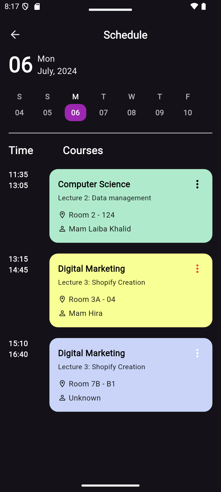
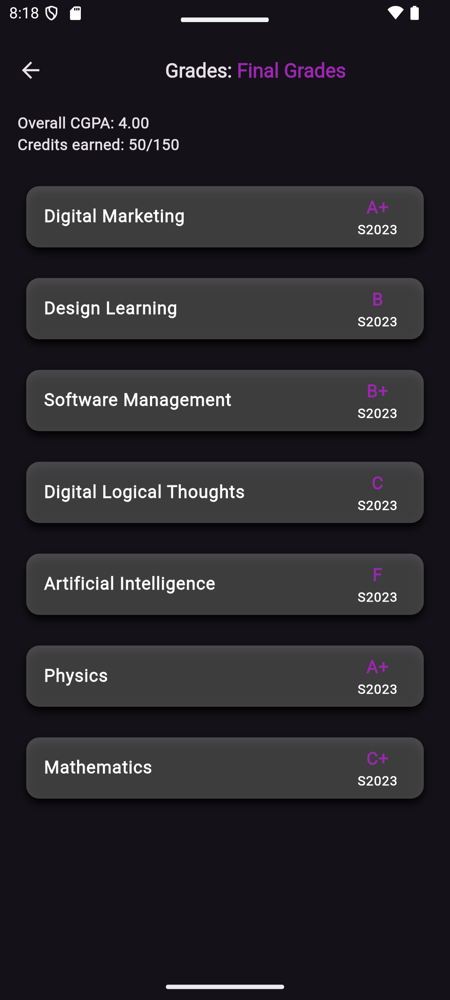
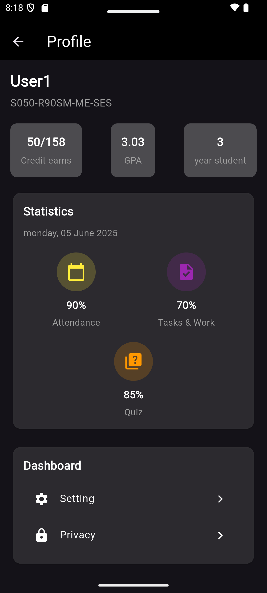

# 🎓 College Campus App

A comprehensive Flutter application designed to streamline university daily activities and enhance the academic experience for students. Built with a clean architecture and modern UI design.

## 📱 Screenshots

<div align="center">
  
  
  
  
</div>

<div align="center">
  
  
  
</div>

## ✨ Features

### Core Functionality
- **📅 Class Schedule Management** - Organize and view your weekly timetable with ease
- **✅ Attendance Tracking** - Monitor your attendance record and maintain consistency
- **📚 Course Management** - Keep track of all your enrolled courses and materials
- **📊 Grade Viewer** - Check your academic performance and GPA
- **🔔 Smart Notifications** - Get timely alerts for classes, assignments, and events
- **👤 Profile Management** - Manage your student profile and personal information
- **📆 Academic Calendar** - Stay updated with important dates and campus events

### Additional Features
- Modern and intuitive user interface
- Smooth navigation and animations
- Custom fonts for better readability
- Responsive design for all screen sizes
- Offline capability for core features
- Dark mode support (coming soon)

## 🛠️ Tech Stack

- **Framework:** Flutter
- **Language:** Dart (45.9% of codebase)
- **UI Components:** Material Design
- **Architecture:** MVC/Clean Architecture
- **Fonts:** Custom font integration
- **Supported Platforms:** Android, iOS, Web, Windows, macOS, Linux

## 📂 Project Structure

```
lib/
├── models/          # Data models and entities
├── views/           # UI screens and pages
├── controllers/     # Business logic
├── widgets/         # Reusable UI components
├── utils/           # Helper functions and utilities
└── constants/       # App constants and configurations

assets/
└── fonts/          # Custom fonts
```

## 🚀 Getting Started

### Prerequisites

Before you begin, ensure you have the following installed:
- Flutter SDK (2.0 or higher)
- Dart SDK
- Android Studio / VS Code with Flutter extensions
- Git

### Installation

1. **Clone the repository**
   ```bash
   git clone https://github.com/maryamabdallahhh/College-Campus.git
   cd College-Campus
   ```

2. **Install dependencies**
   ```bash
   flutter pub get
   ```

3. **Run the app**
   ```bash
   flutter run
   ```

### Building for Production

**Android:**
```bash
flutter build apk --release
```

**iOS:**
```bash
flutter build ios --release
```

**Web:**
```bash
flutter build web --release
```

## 📱 Supported Platforms

This app is built using Flutter, making it compatible with multiple platforms:

- ✅ Android
- ✅ iOS  
- ✅ Web
- ✅ Windows
- ✅ macOS
- ✅ Linux

## 🎨 Design Philosophy

The app follows modern design principles:
- **Clean UI:** Minimalist interface with focus on usability
- **Consistent Design:** Unified color scheme and typography
- **Smooth Animations:** Fluid transitions between screens
- **Custom Fonts:** Enhanced readability and visual appeal
- **Responsive Layouts:** Adapts to different screen sizes

## 🔮 Roadmap & Future Enhancements

- [ ] Integration with university backend systems
- [ ] Real-time chat with classmates and professors
- [ ] Assignment submission and tracking
- [ ] Library book reservation system
- [ ] Campus map with navigation
- [ ] Study groups and collaboration tools
- [ ] Push notifications for important updates
- [ ] Multi-language support (Arabic & English)
- [ ] Dark mode theme
- [ ] Offline data synchronization

## 💼 Use Cases

Perfect for:
- **Universities & Colleges** - Student management and engagement
- **Educational Institutions** - Academic tracking and communication
- **Students** - Personal academic organization
- **Developers** - Learning Flutter and clean architecture

## 🤝 Contributing

Contributions are welcome! If you'd like to contribute:

1. Fork the repository
2. Create your feature branch (`git checkout -b feature/AmazingFeature`)
3. Commit your changes (`git commit -m 'Add some AmazingFeature'`)
4. Push to the branch (`git push origin feature/AmazingFeature`)
5. Open a Pull Request

## 📄 License

This project is available for educational and commercial use. Feel free to use it as a template or reference for your own projects.
 

## 🙏 Acknowledgments

- Flutter team for the amazing framework
- Material Design for UI guidelines
- The open-source community for inspiration

## 📞 Support

If you encounter any issues or have questions:
- Open an issue on GitHub
- Check existing issues for solutions
- Contact the developer
 
   
**Perfect for universities, colleges, and educational institutions looking for a comprehensive student management solution.**
